<link rel="stylesheet" href="css/style.css"></link>

<!--Hoja 1(Portada)-->
### Universidad de San Carlos de Guatemala
### Facultad de Ingeniería
### Ingeniería En Ciencias Y Sistemas
### Segundo Semestre 2021
### Prácticas Iniciales

 

|Integrantes|Carnet|
|-|-|
|Santiago Gilberto Rivadeneira Ruano|201313722|
|Wilfred Stewart Perez Solórzano|201408419|
|Diego Estuardo López Sequén|201901259|
|Danny Hugo Bryan Tejaxún Pichiyá|201908355|
|Denny Mabreth Paz Gameros|201709287|
|Percy Juventino Duarte Gálvez|201709149|
|André Joaquín Ortega De Paz|201900597|

 

<!--Hoja 2-->
___
# Mantenimiento de una Laptop
## Introducción
Darle mantenimiento a una computadora es de vital importancia, además de ser visto desde dos perspectivas distintas, siendo la prevención y la reparación. Se brinda una guía rápida para los usuarios que necesiten hacerle su respectiva limpieza a modo de prevenir problemas a futuro. 

## Objetivos
### General
Orientar de manera rápida y clara a usuarios de laptops para que puedan darle mantenimiento a su equipo.

### Específicos
* Dar a conocer las herramientas necesarias para dar mantenimiento.
* Saber manipular de manera correcta los componentes de la computadora.
* Evitar problemas de funcionamiento del equipo.
* Evitar que los componentes se obstruyan con el polvo.

<!--Hoja 3-->
___
## Herramientas
* Aire Comprimido
* Alcohol Isopropílico
* Limpia Contactos
* Limpiador de Superficies (Espuma)
* Destornilladores
* Pasta Térmica
* Brocha
* Paño de Microfibra
* Recipientes para almacenar tornillos

___
## Procedimiento
**Nota: Se deben depositar los tornillos en un recipiente específico según el área del que fueron removidos.**

### Desmantelación:
1. Remover los tornillos para retirar la carcaza. 
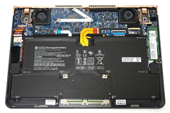

2. Remover el adaptador de red y conector de pantalla. 
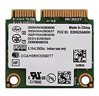

3. Retirar los tornillos correspondientes a la batería y disco duro, para remover dichos componentes. 
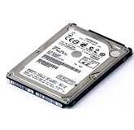
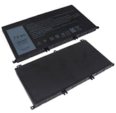

4. Retirar los tornillos situados en la placa base para llegar al teclado. 
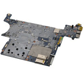
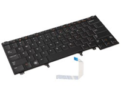
___
### Limpieza:
5. Limpiar el polvo con la brocha en zonas en las que hay exceso de polvo.

6. Limpiar la carcaza. 
    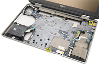

    1. Limpiar con el paño de microfibra y espuma las zonas más accesibles.

    2. Limpiar con aire comprimido las zonas más aisladas o de difícil acceso.

7. Retirar ventiladores y tarjeta madre.
    1. Limpiar los ventiladores con el limpiacontactos, la brocha y el paño de microfibra. 
    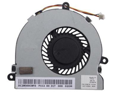

    2. Limpiar las zonas empolvadas con limpiador de superficies o aire comprimido si fuera necesario. 
    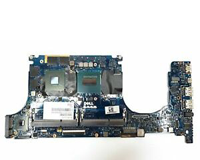

8. Retirar los componentes de la tarjeta madre. 
    **Nota: Al finalizar el proceso es necesario aplicar pasta térmica de nuevo en el procesador y disipador de calor.**
    1. Retirar el disipador de calor. 
    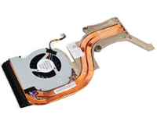
    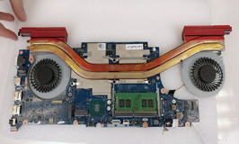
    
    2. Con el limpiador de superficies, remover la pasta térmica del procesador y del disipador de calor.
    
    3. Retirar la memoria RAM para poder limpiar los pines del *socket*. Los pines son limpiados con aire comprimido. 
    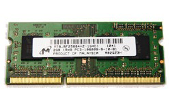
    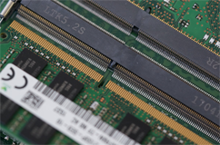

    4. Limpiar las salidas de calor del disipador para que no se obstruyan con polvo.

9. Limpiar con aire comprimido las entradas del disco duro. 
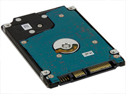

10. Limpiar la batería con el paño de microfibra.

11. Limpiar la carcaza que contiene el teclado con la brocha y un trapo. Seguidamente se hace lo mismo con la parte inferior de la carcaza. 
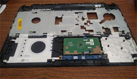

12. Limpiar con el limpiacontactos las entradas del adaptador de red y del conector de la pantalla. 
___
### Reubicación de los componentes:
13. Acoplar nuevamente el disipador de calor a la tarjeta madre.
14. Acoplar la tarjeta madre en su zona correspondiente.
15. Acoplar los ventiladores en su zona correspondiente y conectarlos nuevamente a la tarjeta madre.
16. Conectar el teclado a la tarjeta madre y atornillarlo a la carcaza.
17. Conectar el adaptador de red y el conector de la pantalla a la tarjeta madre.
18. Conectar la batería y el disco duro.
19. Finalmente, atornillar nuevamente la carcaza de la parte inferior para cubrir totalmente todos los componentes internos de la computadora.                
